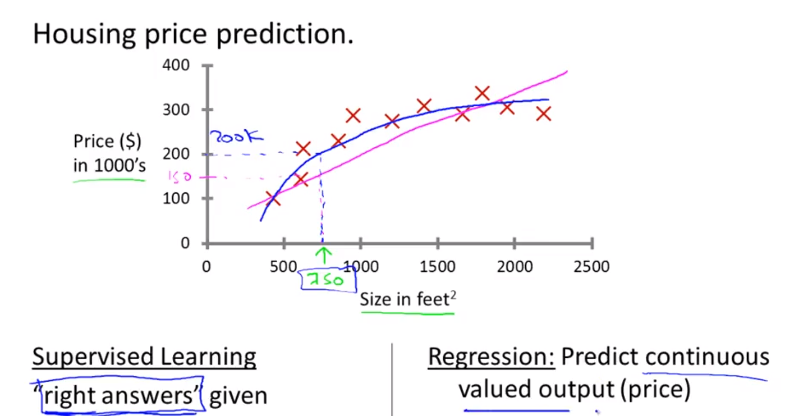
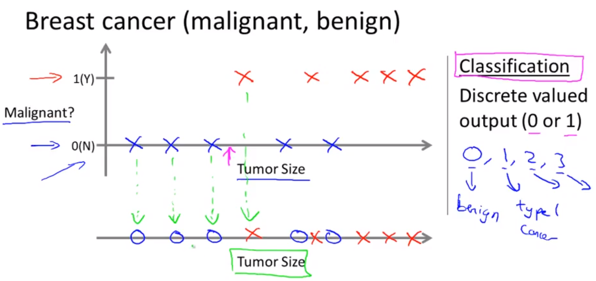
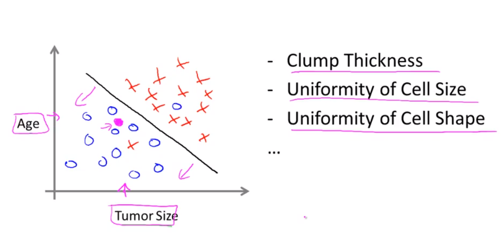

Supervised learning is the machine learning task of learning a function that maps an input to an output based on example input-output pairs. It infers a function from labeled training data consisting of a set of training examples, *for every example in the training data set, the correct answer is already given*.

监督学习：对学习数据集中的每一个样本数据都会给出相应的“正确答案”，因此可以根据答案修正学习过程，以得到最匹配的算法。

There are two types of supervised learning problems:

### Regression problem

In a regression problem, the supervised learning algorithm is trying to predict results within a continuous output, meaning that it is trying to map input variables to some continuous function. 

线性回归：试图预测一个连续的输出值，学习得到的算法为一个线性函。

**Example**

Given data about the size of houses on the real estate market, try to predict their price. Price as a function of size is a continuous output, so this is a regression problem.

House Price Prediction

### Classification problem 

In a classification problem, the supervised learning algorithm is instead trying to predict results within a discrete output, meaning that it is trying to map input variables to discrete categories. 

分类问题：根据数据的特点将数据划分到指定的类型中，其学习得到的算法为一个离散函数。

**Example**

Classification - Given a patient with a tumor, we have to predict whether the tumor is malignant or benign.

Breast cancer prediction with one feature

Breast cancer prediction with two features
